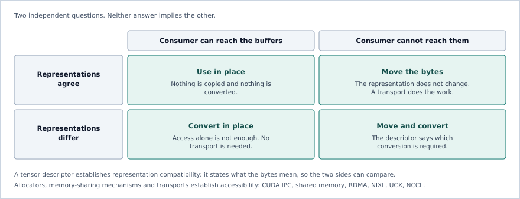

# Tensor Data Interchange for AI/ML Systems: A Survey and the Hurray Proposal

**Revision:** September 2026 · Also available as [PDF](prior-art.pdf)

**Hurray project:** https://pgillet.github.io/hurray/  
**Source code and specification:** https://github.com/pgillet/hurray

---

## Abstract

AI/ML systems move large amounts of tensor data between libraries,
processes, machines, accelerators, and storage. Model weights are loaded
from files into accelerator memory. Frameworks exchange tensors without
copying them. Distributed training splits tensors across GPUs.
Disaggregated inference transfers key-value (KV) caches between prefill
and decode workers.

A **tensor** is a multidimensional array of values. Moving a tensor from
one system to another requires transferring its data, but also enough
information to interpret that data: its element type, shape, and
**memory layout**, i.e. how its elements are arranged in memory. Some
tensors require additional information. Quantized tensors store values
using lower-precision encodings and associated parameters such as
scales. Sparse tensors store selected values together with indexes
instead of storing every value. Paged KV caches use blocks whose
physical order can differ from their logical sequence order. Tensors can
also be split, or **sharded**, across several devices.

Several interchange solutions cover parts of this information. DLPack
describes strided tensors in memory, including their device. Apache
Arrow defines dense and sparse tensor IPC (inter-process communication)
representations and has added fixed- and variable-shape tensor types to
its columnar data model.
SafeTensors and GGUF store model tensors in files, with GGUF supporting
many quantized representations. Zarr and NetCDF store large
multidimensional arrays. NIXL and UCX move memory efficiently between
machines and devices, while NCCL provides communication operations
between GPUs.

This paper compares these solutions and the tensor information they
preserve. The comparison shows a practical gap for tensors whose
physical representation matters to computation. Layout, quantization,
device memory, paging, and sharding increasingly appear at the
boundaries between runtimes, but among the systems surveyed here, no
widely used interchange format combines these properties in one tensor
description reusable across memory, files, and network transfers.

We then present **Hurray**, an open-source tensor interchange project
designed for this use case. Hurray defines a language-independent
descriptor for a tensor's type, shape, layout, quantization, device and
memory placement, buffers, and composition. The same descriptor is used
for streaming and persistent files and can accompany data moved through
existing communication systems.

The goal is simple: when two runtimes support the same tensor
representation, they should be able to exchange it without first
converting it to an intermediate layout. When they do not, the
difference should be explicit so that the required conversion can be
selected.

---

## 1. Introduction

AI/ML applications rarely run inside a single library.

A Python application may prepare input with NumPy, execute a model with
PyTorch, call kernels through CUDA, exchange tensors with another
runtime, and store model weights in SafeTensors or GGUF. A distributed
training job can split one tensor across dozens or hundreds of
accelerators. An inference service can compute a KV cache on one GPU and
consume it on another machine.

At each boundary, two things have to move: **the tensor data and the
information needed to interpret it**.

For a simple tensor this information is small. Consider a `float32`
matrix with shape `[1024, 4096]`, stored consecutively by rows. A
receiver needs to know the data type, the two dimensions, and where the
data starts.

Modern tensor representations can be more complicated.

A matrix may be transposed without moving its data. A GPU kernel may
require values to be stored in tiles. A four-bit weight tensor may pack
several values into each byte and use one scale per block. A sparse
matrix may consist of a value buffer and several index buffers. A KV
cache may be divided into pages spread across GPU memory. A distributed
tensor may be split across several GPUs.

These representations matter because converting between them costs time
and memory bandwidth.

The raw parameter payload of a 70-billion-parameter model is about 140
GB at 16 bits per parameter and about 35 GB at 4 bits per parameter,
before quantization metadata and other overheads. Converting a tensor of
this size merely to cross a software boundary can require reading and
writing tens or hundreds of gigabytes of memory.

The same issue appears at smaller scales but higher frequencies. An
inference server can transfer KV-cache blocks for many requests between
workers. If producer and consumer already support the same cache layout,
converting those blocks to a generic dense representation before
transfer is unnecessary work.

A tensor interchange format determines how much of the original
representation survives such a boundary.

This paper surveys existing approaches to tensor interchange. It covers
in-memory interfaces, data formats, scientific array storage,
communication systems, and recent work on distributed inference. The
systems considered include DLPack, Apache Arrow, SafeTensors, GGUF,
Zarr, NetCDF, NIXL, UCX, and NCCL.

The survey then considers Hurray, an open-source project that defines a
broader tensor descriptor covering layout, quantization, memory
placement, and tensor composition.

Hurray is currently a beta, pre-1.0 project. Its relevance therefore
depends less on its current adoption than on the question examined in
this paper: **which information should a common tensor interchange
format carry?**

---

## 2. What Describes a Tensor?

### 2.1 Shape and data type

A tensor generalizes a scalar, vector, or matrix to any number of
dimensions.

A vector of length 10 has shape `[10]`. A matrix with 1024 rows and 4096
columns has shape `[1024,4096]`. A batch of 32 RGB images with height
and width 224 may have shape `[32,3,224,224]`.

The number of dimensions is the tensor's **rank**. The tensor also has
an element type, such as `float32`, `float16`, `bfloat16`, or `int8`.

Shape and type describe the logical array, but not necessarily how it is
stored.

### 2.2 Dense tensors and strides

A **dense tensor** stores a value for every position in the array.

The simplest dense layout stores values consecutively. A C-style matrix
normally stores one complete row after another. A Fortran-style matrix
normally stores one complete column after another.

Many tensor libraries use **strides** to describe more general layouts.
For a tensor with indexes `(i_0,...,i_{n-1})`, an ordinary strided
representation can calculate the element position as:

`o + sum(i_k * s_k)`

where `o` is an initial offset and `s_k` is the stride of dimension `k`.

Strides make many tensor operations cheap. A transpose can often
exchange dimensions and strides without moving the underlying values. A
slice can adjust the starting offset and strides. Broadcasting can use a
zero stride for a repeated dimension.

DLPack uses this model. It covers a large and important set of tensor
views, but not every layout used by current accelerators and inference
systems.

### 2.3 Memory layout

The **memory layout** of a tensor is the rule that maps a logical
element such as `[i,j,k]` to the bytes that store it.

Strides are one such rule.

A **tiled layout** divides a tensor into smaller rectangular blocks and
specifies how the blocks and their contents are ordered. Tiling can
improve cache locality or match the matrix representation expected by
accelerator hardware.

A **packed layout** rearranges values into the exact order a particular
instruction or kernel reads them, and the result may no longer be
described by one ordinary stride per dimension.

A **paged layout** divides the tensor into separately allocated blocks.
A table maps logical regions of the tensor to those physical blocks.
KV-cache management in modern LLM serving systems is an important
example.

The layout is therefore part of the information a consumer needs if it
wants to use the existing representation directly.

### 2.4 Sparse tensors

A **sparse tensor** avoids storing positions whose value is implicitly
zero or another default value. Instead, it stores selected values plus
indexes identifying their positions. Instead of storing a
million-element matrix with only ten thousand non-zero values, a sparse
representation stores those ten thousand values and the indexes that
locate them.

COO, or coordinate format, records coordinates for stored values. CSR,
or compressed sparse row format, compresses indexes by matrix row. CSC
performs a similar operation by column. Higher-dimensional sparse arrays
can use structures such as CSF, compressed sparse fiber.

A sparse tensor is consequently often made from several buffers: values,
indexes, and offsets. Shape alone cannot describe it.

Apache Arrow is notable here because it defines standardized sparse
tensor representations in addition to dense tensors.

### 2.5 Quantization

**Quantization** stores numerical values at lower precision to reduce
memory use and often increase compute throughput.

A simple affine scheme can reconstruct an approximate value as
`x_hat = s(q-z)`, where `q` is the stored integer, `s` a scale, and `z`
a zero point. The scale can apply to the whole tensor, one channel, or a
small block of values.

Other schemes work differently. NF4 uses a small codebook. Block
floating-point formats share scaling information across groups.
Microscaling formats combine low-precision values with block-level
scales.

A quantized tensor can therefore require more information than a
data-type name: the logical type, storage type, quantization scheme,
scales and optional zero points, grouping or block size, and, for
sub-byte values, how bits are packed.

Two formats both called "4-bit" are not necessarily compatible.

### 2.6 Where the tensor is stored

Tensor data can reside in different kinds of memory.

**Host memory** is memory directly available to the CPU. **Accelerator
memory** is memory associated with a GPU or another accelerator.
**Unified memory** provides an address-space abstraction shared across
processors, with the underlying system managing access or migration.

Other relevant cases include pinned host memory, operating-system shared
memory, GPU memory accessible by peer devices, and memory registered for
RDMA.

This information matters for zero-copy interchange. A consumer may
understand a tensor's layout perfectly but still be unable to access its
buffers where they currently reside.

### 2.7 Sharding and tensor composition

Large tensors are often divided among devices. This is called
**sharding**. Distributed training systems treat tensor partitioning
over devices as a first-class concern [17].

For example, a matrix with shape `[65536,16384]` might be divided by
rows across eight GPUs. Each GPU stores a `[8192,16384]` shard.

Describing each shard independently does not describe the global tensor.
The receiver also needs to know which part of the global tensor each
shard represents.

A related concept is **tensor composition**. In this paper, that means
describing one tensor or tensor artifact using several constituent
tensors or regions. It can cover shards of one distributed tensor,
several named tensors grouped in one model, sparse values and their
index tensors, a quantized tensor and its scale tensors, and
heterogeneous regions stored in different formats.

---

## 3. What an Interchange Format Needs to Do

### 3.1 Describe the tensor

The receiver needs enough metadata to interpret the buffers. For a basic
dense tensor, this means shape, type, and layout. Other tensors can
require sparse indexes, quantization parameters, page tables, or
information about constituent tensors.

### 3.2 Avoid copies when possible

**Zero-copy interchange** means that the receiver can use an existing
data buffer directly, by being passed a pointer or a memory handle rather
than the bytes, instead of copying the tensor merely to cross an
interface.

Zero-copy is not always possible. The receiver must understand the
representation, be able to access the memory, satisfy alignment
requirements, and observe the correct lifetime and synchronization
rules. **Buffer alignment** is the requirement that a buffer start at an
address that is a multiple of some specified size. Particular
instructions and device interfaces can require it, and where they do
not, it can still affect throughput. A format can state a minimum
alignment rather than leaving it to convention. Synchronization matters
because the producer may not have finished: if an accelerator is still
writing the data, the consumer must wait for the appropriate
synchronization point before reading it.

A format cannot guarantee zero-copy in every situation. It can provide
enough information for the receiver to determine whether zero-copy is
possible.

### 3.3 Stream large tensors

A streaming representation should let the receiver read the tensor
description first and then process its payload incrementally. This is
useful for network transfers and pipelines where a tensor can begin
moving before the complete object is available at the destination.

### 3.4 Read individual tensors from files

A model can contain hundreds or thousands of named tensors. A reader
should be able to locate one tensor without scanning or loading the
entire file. Memory mapping is also useful because the operating system
can map file pages into the process address space and load them on
demand.

### 3.5 Work across languages

A tensor format is more useful when its definition does not depend on a
Python or C++ object. DLPack and Apache Arrow both use language-neutral
specifications and C-compatible interfaces to connect independent
implementations. Such an interface is an **ABI**, or application
binary interface: a fixed binary representation of structures and calls
that separately compiled components can rely on without agreeing at
source level.

### 3.6 Stay separate from the transport

Describing a tensor and moving its bytes are different jobs.

Shared memory, TCP, RDMA, CUDA IPC, NIXL, UCX, and other mechanisms can
all carry data. A tensor descriptor does not need to replace them. It
needs to tell the receiving application what the transferred buffers
contain.

---

## 4. DLPack: In-Memory Tensor Exchange

DLPack [1] is one of the most widely used mechanisms for exchanging tensors
between machine-learning frameworks.

Its basic `DLTensor` structure carries a data pointer, a device, the
number of dimensions, a data type, a shape, strides, and a byte offset.
Current DLPack also defines low-precision floating-point data types,
including several FP8 and smaller formats. Managed tensor structures add
lifetime information so the consumer and producer can coordinate
ownership.

This is already a useful tensor descriptor.

A PyTorch tensor can, for example, be passed to another
DLPack-compatible framework without converting it into an intermediate
file or copying its data simply because the framework changes.

DLPack is especially well matched to ordinary strided tensors. It also
carries device information. Its scope is intentionally small.

DLPack does not define a file format or a network framing protocol. A
`DLTensor` describes one tensor rather than a distributed group of
shards. Its core tensor structure does not provide standard descriptions
for sparse indexes, paged KV caches, arbitrary accelerator tiling, or
generic quantization parameters.

DLPack's main strength is precisely that a small common representation
is easy for frameworks to adopt.

---

## 5. Apache Arrow

Apache Arrow [2] is the most mature example of a common physical data
representation shared across many languages and systems.

Arrow is primarily designed for the **tabular model**: data as a set of
records, typically rows from a relational database, each a set of named
typed fields, stored in a **columnar** physical representation, with
buffers defined by each Arrow type. Its basic objects are arrays, record
batches, and tables. The Arrow specification defines their in-memory
representation independently of a particular language implementation.
The C Data Interface allows libraries in one process to share Arrow
buffers, while **Arrow IPC** defines serialized messages for exchanging
Arrow data between processes or storing it in streams and files.

Arrow also has substantial tensor support.

### 5.1 Standalone Tensor

Arrow defines a standalone `Tensor` structure [3] for multidimensional
arrays. The representation contains tensor shape and strides and can
therefore describe conventional strided multidimensional arrays.

Arrow also defines alignment rules for these tensor IPC structures.
Standalone tensor bodies are aligned to 64-byte boundaries.

### 5.2 SparseTensor

Arrow separately defines `SparseTensor` [3].

This is significant because sparse tensors cannot in general be reduced
to shape plus strides. Arrow defines standard sparse index structures
and specifies how the associated buffers are represented.

Arrow therefore covers more than one tensor layout family.

### 5.3 Tensor-valued Arrow columns

Arrow also defines the canonical extension types
`arrow.fixed_shape_tensor` and `arrow.variable_shape_tensor` [4].

These allow tensor-valued observations to participate in Arrow's normal
columnar data model. The fixed-shape representation records tensor shape
and can include dimension names and a permutation between logical and
physical dimensions. The variable-shape representation supports tensor
values whose dimensions vary.

The elements of these canonical tensor extensions are stored in
row-major, C-contiguous order. A permutation can change the logical
interpretation of dimensions, but it does not define an arbitrary tiled
or paged physical layout.

### 5.4 Arrow Flight

Arrow Flight [5] provides high-performance network transfer for Arrow
data. Flight uses Arrow IPC and gRPC with implementation optimizations
designed to avoid unnecessary serialization and memory copies, and
published benchmarks report multi-gigabyte-per-second transfers with high
utilization of the available network bandwidth [6].

Flight is therefore strong prior art for network data interchange. The
more relevant difference for computational tensors is what the
transferred metadata describes.

Arrow's mature streaming ecosystem is centered on its columnar data
model and RecordBatches. Its tensor structures do not provide a general
description of accelerator-specific packed layouts, quantization
schemes, paged KV caches, device memory, or distributed tensor
composition.

### 5.5 What Arrow establishes

Arrow demonstrates that a public physical format can be shared by
independent implementations; metadata and buffers can be separated; the
same data model can support memory sharing and serialized interchange;
alignment can be part of the format; extensions can add domain-specific
semantics; and high-performance network transfer can be built around the
same representation.

These principles are a major influence on Hurray.

---

## 6. Tensor and Array Files

### 6.1 SafeTensors

SafeTensors [7] is a simple format for storing named tensors, particularly
model weights. Its header records tensor names, types, shapes, and byte
ranges. The format supports memory-mapped and selective access.

SafeTensors deliberately keeps the tensor representation simple. It is
not intended to describe a live GPU allocation, a paged cache, a sharded
tensor, or a kernel-specific packed matrix.

### 6.2 GGUF

GGUF [8] is a model format developed in the GGML ecosystem. It stores model
metadata and named tensors in one file and is especially relevant
because it supports many quantized tensor types.

Types such as `Q4_0` and `Q4_K` identify concrete GGML encodings. Their
block structure, scales, and packing follow the definition of the
selected GGML tensor type rather than a generic quantization descriptor
stored with each tensor.

GGUF therefore provides strong prior art for preserving quantized
representations in a portable artifact. Its quantization model is tied
to named GGML tensor encodings rather than a general parameterized
quantization descriptor intended for arbitrary runtimes.

### 6.3 Zarr and NetCDF

Zarr [9] divides large multidimensional arrays into independently stored
chunks. NetCDF [10] provides named multidimensional scientific variables and
supports partial access, with modern NetCDF storage able to use chunked
layouts through HDF5.

These formats show that large arrays need not be loaded as complete
files. Their layouts primarily optimize persistence and data access
rather than the in-memory representation expected directly by
accelerator kernels.

---

## 7. Moving Data: UCX, NIXL, and NCCL

Tensor formats and communication libraries solve different problems. The
former describe data. The latter move it.

UCX [11] provides communication primitives over different hardware transports
and generally treats transferred memory as buffers whose meaning is
supplied by the application.

NIXL [12] targets point-to-point data movement in distributed inference and
abstracts memory and storage types including GPU HBM, CPU DRAM, SSDs,
and distributed storage. On suitable systems, it can use GPU Direct RDMA
to transfer data directly between registered GPU memory regions.

NCCL [13] provides optimized collective and point-to-point communication
between GPUs. It can use several paths depending on the hardware,
including PCIe, NVLink, InfiniBand, and network sockets.

These systems do not need to understand that a buffer is a tiled matrix
or a paged KV cache. A tensor interchange format can complement them by
providing the description shared by the applications at either end.

---

## 8. Comparison

| System | Main use | Tensor model and layout | Quantization | Device / memory | Composition | File | Network / stream |
|:----------|:------------|:--------------|:----------|:----------|:-----------|:---------|:---------|
| DLPack | In-process framework exchange | Shape, type, dense strides | No generic scheme | Device | Single tensor | No | No |
| Arrow Tensor | Tensor IPC | Shape, type, dense strides | No generic scheme | Not central | Single tensor | Standalone IPC | Standalone IPC |
| Arrow SparseTensor | Sparse tensor IPC | Shape, type, standard sparse formats | No generic scheme | Not central | Multi-buffer sparse tensor | Standalone IPC | Standalone IPC |
| Arrow tensor extensions | Tensor-valued columns | Shape, type, C-contiguous + logical permutation | No generic scheme | External | Arrow arrays/tables | Arrow IPC | Flight / IPC |
| SafeTensors | Model files | Shape, type, conventional dense | No generic scheme | No live placement | Named tensors | Yes | No standard runtime stream |
| GGUF | Model files | Shape, type, GGML encodings | GGML quantized types | No live placement | Named tensors | Yes | No runtime protocol |
| Zarr / NetCDF | Large arrays | Shape, type, storage-oriented | Application specific | No live placement | Dataset hierarchy | Yes | Remote access possible |
| UCX | Communication | None; opaque buffers | Opaque | Memory buffers | Application-defined | No | Yes |
| NIXL | Inference data movement | None; opaque buffers | Opaque | CPU/GPU/storage aware | Application-defined | Storage backends | Yes |
| NCCL | GPU communication | Element type and count only | Opaque | GPU-oriented | Application-defined | No | Yes |

Existing systems already provide strong support for conventional dense
tensors, sparse IPC, persistent model storage, scientific arrays, and
high-performance communication.

The less standardized case is a tensor that is simultaneously, for
example, quantized, paged, sharded, resident in GPU memory, and composed
from several buffers. Frameworks can represent such tensors internally,
but this information is normally exchanged through framework-specific
structures or application protocols.

---

## 9. Distributed LLM Inference as a Concrete Case

Transformer inference stores previously computed keys and values in a
**KV cache**. Systems such as vLLM divide this cache into reusable
blocks rather than allocating one contiguous buffer.

Kwon et al. introduced PagedAttention and vLLM [14], applying paging ideas
to KV-cache management. Logical cache blocks can map to non-contiguous
physical blocks.

DistServe [15] separates prefill and decode onto different GPUs. Once those
phases run on different workers, the KV cache must cross the boundary
between them.

Mooncake [16] develops this further by treating KV cache as distributed state
spanning GPU memory, CPU DRAM, and SSD storage.

**Figure 1.** KV cache transfer between a prefill worker and a decode worker.
The transport moves the blocks; what the blocks represent is agreed outside the
transfer.

Different workers can also use different parallel decompositions.
TensorRT-LLM's disaggregated-serving support [18] includes cache-layout
transformation when context and generation workers use different
parallel strategies.

This gives a concrete interchange problem:

**Producer:** "Here is the KV cache in representation A."

**Consumer:** "I can consume A directly," or "I require representation
B."

Today this agreement is generally implemented inside the serving system.
A common descriptor can make it explicit.

---

## 10. What Is Still Needed, and What Hurray Proposes

The survey suggests several requirements that are useful together:

1.  A common description of dense, sparse, tiled, packed, and paged
    layouts where these representations are shared between runtimes.
2.  Quantization metadata including storage type, scheme, grouping,
    scales, zero points where applicable, and packing.
3.  Memory and device information sufficient to decide how buffers can
    be accessed.
4.  Support for tensors made from several buffers.
5.  A way to describe shards as parts of a larger logical tensor.
6.  A tensor description reusable in streams and files.
7.  Negotiation so producer and consumer can agree on a representation
    before moving a large payload.
8.  A language-neutral runtime interface.

Supporting many representations creates complexity. A useful standard
therefore needs a small common subset and explicit optional
capabilities.

Hurray [19], [20] is an open-source project that defines this broader
tensor description. The project is currently beta and pre-1.0. The rest
of this section states what it standardizes and how it addresses each
requirement above.

### 10.1 Interoperability boundary

**Hurray standardizes the representation needed to decide whether a
tensor can be consumed directly. It does not standardize the mechanism
that makes the tensor accessible.**

Those are two independent questions, and keeping them apart is what lets
a descriptor be useful without duplicating a transport.

**Representation compatibility** asks whether the two sides agree on what
the bytes mean: element type, shape, layout, quantization, buffer
relationships, composition. **Memory accessibility** asks whether the
consumer can reach those buffers where they currently are.

Neither answer implies the other. Two runtimes may agree exactly on BF16,
a paged layout, and 64-token blocks, and still need NIXL or CUDA IPC
before either can touch the other's buffers. Conversely, CUDA IPC may
give one runtime access to another's GPU allocation, and that access is
useless unless both sides agree on what the bytes mean.

**Figure 2.** Representation compatibility and memory accessibility are
independent. A tensor descriptor establishes representation
compatibility; allocators, memory-sharing mechanisms, and transports
establish accessibility.

Hurray standardizes representation compatibility. It defines the tensor's
logical type and shape, physical layout, quantization information, buffer
relationships, device and memory information, composition, and the
synchronization information needed to determine when the data can be
consumed, which is enough for an independent runtime to decide whether it
can consume the representation directly.

It does not standardize how a GPU buffer is allocated, how RDMA or CUDA
IPC establishes access to it, how a communication library moves it, how
a kernel is scheduled, or how a runtime internally converts an
unsupported representation.

In short, Hurray answers:

**"What tensor is in these buffers, and how is it represented?"**

The surrounding runtime and communication stack answer:

**"How do I access, move, convert, or execute on those buffers?"**

This keeps Hurray complementary to DLPack, CUDA IPC, UCX, NIXL, NCCL,
and similar systems.

### 10.2 How Hurray addresses the requirements

Hurray's central object is a language-independent tensor descriptor. It
describes properties including logical element type, storage type,
shape, memory layout, quantization, device and memory class, buffers,
synchronization, and composition. The same description can be bound to
different kinds of buffers depending on where it is used: a file offset,
a host pointer, and a GPU memory handle are different ways of locating
data, and they do not change the tensor's shape, quantization, or
layout.

The eight requirements are addressed as follows.

1.  **Layouts.** Hurray currently defines twelve layout families,
    including conventional dense layouts as well as strided, sparse,
    space-filling, paged, and composite representations. Each layout has
    a tag and layout-specific parameters, so a consumer can identify the
    address mapping rather than assuming that every tensor is row-major.
2.  **Quantization.** Hurray treats quantization separately from storage
    type. Its current specification includes normative schemes for
    common affine quantization cases and additional low-precision
    representations such as NF4 and MXFP. This lets runtimes reason
    independently about logical type, storage type, and quantization.
3.  **Device and memory.** Device, memory, and synchronization
    information travels with the tensor. This does not replace CUDA IPC,
    RDMA registration, NIXL, or another memory-transfer API; those
    mechanisms provide the actual buffer access.
4.  **Several buffers.** One descriptor can reference the buffers a
    tensor is made from, such as values and their indexes, or values and
    their scales, rather than a single base pointer.
5.  **Shards and composition.** Composite descriptions let one logical
    object refer to several regions or tensors. This provides a basis
    for sharded tensors, sparse representations, quantization parameters
    stored separately from values, paged structures, and heterogeneous
    regions.
6.  **Streams and files.** The streaming form places the tensor
    descriptor before its payload, so a receiver can determine what is
    arriving before all tensor bytes have arrived. The persistent file
    form contains named tensors and an index for locating them, and
    reuses the same tensor descriptor as the streaming form.
7.  **Negotiation.** Naming the layout, element type, and quantization
    scheme explicitly is what makes capability comparison possible;
    Hurray's interchange protocol carries the exchange itself, with each
    side advertising the layouts it supports and a request stating an
    ordered preference. The worked example below turns the outcome into
    three cases: direct use, relocation without reformatting, or
    explicit conversion.
8.  **Language-neutral interface.** Hurray provides a C ABI as its
    runtime boundary, following the same practical approach used by
    DLPack and Arrow's C interfaces.

---

## 11. Hurray Compared with Existing Solutions

Hurray overlaps with DLPack on language-independent tensor exchange,
with Arrow on publicly specified buffer representations, with
SafeTensors on indexed persistent storage, and with GGUF on preserving
low-precision representations.

It is complementary to UCX, NIXL, and NCCL, which move the data rather
than describe the complete tensor.

| Capability | DLPack | Arrow tensor facilities | SafeTensors | GGUF | NIXL/UCX/NCCL | Hurray |
|:-------------|:---------|:-----------|:---------|:----------|:----------|:------------|
| Shape and element type | Struct fields | IPC message fields | Header fields | Tensor entry fields | Opaque buffers; NCCL: datatype + count | Descriptor fields |
| Dense strides | Strides field | Strides in Tensor message | Row-major only | Fixed by tensor type | Opaque bytes | Strided layout tag |
| Standard sparse representation | Not defined | SparseTensor message | Not defined | Not defined | Opaque bytes | Sparse layout tags |
| Specialized layouts | Not defined | Not defined | Not defined | Within GGML types | Opaque bytes | Layout tag, extensible |
| Paged tensor layout | Not defined | Not defined | Not defined | Not defined | Opaque bytes | Paged layout tag |
| Generic quantization metadata | Not defined | Not defined | No standardized scheme | GGML tensor type | Opaque bytes | Quantization descriptor |
| Device information | Device field | Not central | Not defined | Not defined | Transport handles | Device, memory fields |
| Sharding / composition | Single tensor | Higher-level structures | Named tensors | Named tensors | Application-defined | Composite descriptor |
| In-process ABI | C struct ABI | C Data Interface | Not defined | Library-specific | Library APIs | C ABI |
| Stream representation | Not defined | Arrow IPC, Flight | Not defined | File-oriented | Byte transport only | Streaming form |
| Indexed file | Not defined | Arrow IPC file | Header offsets | Tensor offsets | Not defined | File form with index |
| Representation negotiation | Application | Application | Not defined | Not defined | Application | Capability comparison / negotiation |

This is not a scorecard. Simpler formats can be easier to implement and
more interoperable: DLPack's simplicity has helped its adoption, Arrow's
strict physical formats make zero-copy interoperability predictable, and
SafeTensors' restricted model makes files easy to parse safely. Hurray makes
a different trade-off: it describes more physical representations in order to
avoid forcing every computational tensor through one common dense layout.

A richer descriptor has to justify its complexity, and the clearest case is
where converting the representation is itself expensive. If two runtimes both
understand the same tiled or paged representation, converting a large tensor
to row-major solely for interchange wastes memory bandwidth. If they do not
understand the same representation, the conversion is unavoidable and should
be explicit.

---

## 12. Example: Exchanging a Paged KV Cache

Consider a prefill worker that has produced a BF16 KV cache stored in
GPU memory, divided into 64-token blocks, sharded across four GPUs,
represented by a block table, and ready for a decode worker on another
machine.

The transfer itself could use NIXL.

Without a shared tensor description, the two applications need a private
agreement covering model-dependent dimensions, element type, block size,
block-table format, shard mapping, GPU buffers, synchronization, and the
relationship between transferred blocks and the request.

**Figure 3.** Application-specific agreement and descriptor-based interchange.
A descriptor covers the representation; agreement about the request and the
model remains application-specific.

With a common descriptor, the consumer can make one of three decisions.
The result depends on both representation compatibility and memory
accessibility.

**Direct use.** The consumer supports the same representation. No layout
conversion is necessary.

**Relocation without reformatting.** The consumer supports the layout
but needs the buffers in different GPU memory.

**Conversion.** The consumer requires another block size, shard mapping,
element type, or layout.

The descriptor does not eliminate conversion. It identifies when
conversion is required.

> **Use the existing representation when possible; convert explicitly
> when necessary.**

---

## 13. Open Questions

Hurray is not yet a mature standard.

Every additional layout increases implementation work. If the standard
defines too few, it cannot preserve the representations that motivated
it. If it defines too many, implementations may support disjoint
subsets.

Hardware layouts and quantization schemes also change quickly.
Extensions are necessary, but an extension identifier alone does not
create interoperability. Public layouts and quantization schemes still
need precise definitions and canonical test data.

Device handles pose another boundary. A device identifier is portable
metadata; a live CUDA IPC or RDMA handle is not. Hurray therefore needs
to keep tensor semantics separate from transport-specific buffer access.

Security also matters. Shapes, strides, offsets, indexes, and
composition metadata feed into memory calculations. Implementations need
strict validation, overflow checks, fuzzing, and adversarial test cases.

Most importantly, the format needs independent implementations.

Useful conformance tests include C++ producer to Rust consumer, PyTorch
to a non-PyTorch runtime, independently decoded quantized tensors,
sparse tensors, paged KV caches, GPU-to-GPU transfer through NIXL, and
sharded tensors with different destination layouts.

For each standard layout and quantization scheme, the project should
provide small canonical byte-level examples with known results.

---

## 14. Conclusion

AI/ML systems increasingly move tensors between frameworks,
accelerators, processes, machines, and storage.

For ordinary dense tensors, this problem is already well served. DLPack
provides a compact in-memory ABI with shape, type, strides, byte offset,
and device information. Apache Arrow provides standardized dense and
sparse tensor IPC and fixed- and variable-shape tensor types in its
columnar model.

Persistent formats cover another part of the problem. SafeTensors
provides simple indexed model storage, while GGUF preserves a wide range
of quantized model representations. Zarr and NetCDF provide scalable
access to large multidimensional datasets.

Communication systems cover the data path. UCX, NIXL, and NCCL can move
memory efficiently without needing to understand the complete tensor
stored in that memory.

At the same time, the tensors used by current compute systems are
becoming more varied. PagedAttention made block-based KV-cache storage a
central part of LLM serving. DistServe separated prefill and decode
across GPUs. Mooncake treats KV cache as distributed state spanning GPU
memory, host memory, and storage. Distributed training systems routinely
partition and repartition tensors across devices.

In these cases, moving the bytes is only part of the problem. The
receiver also needs to know how those bytes represent the tensor.

Hurray proposes one description for that information: shape and type,
but also layout, quantization, memory placement, buffers,
synchronization, and composition. The descriptor is shared between its
streaming and file formats and is designed to sit above existing memory
and communication mechanisms.

The proposal can be summarized in one rule:

**If producer and consumer support the same tensor representation,
preserve it. If they do not, describe the difference clearly enough to
perform the required conversion.**

Whether Hurray becomes useful will depend on adoption and
interoperability, not on how many features its specification contains.
Independent implementations need to agree on layouts and quantization
byte for byte. Real integrations need to show that preserving tensor
representations removes meaningful copies or conversions. The common
subset must remain simple enough for runtimes to implement.

Apache Arrow showed the value of agreeing on the physical representation
of data rather than on one library's objects. DLPack showed that the
same principle works for tensors when the representation is kept small.

Hurray explores how far that idea can be extended to tensors that are
quantized, sparse, tiled, paged, sharded, and resident on accelerators.

**Project website:** https://pgillet.github.io/hurray/  
**Source code and specification:** https://github.com/pgillet/hurray

---

## References

1.  DLPack Project. *DLPack: Open In-Memory Tensor Structure*,
    specification and `dlpack.h`. DMLC.
    https://dmlc.github.io/dlpack/latest/ and
    https://github.com/dmlc/dlpack
2.  Apache Arrow Project. *Apache Arrow Columnar Format*. Apache
    Software Foundation. https://arrow.apache.org/docs/format/
3.  Apache Arrow Project. *Other Data Structures: Tensor and
    SparseTensor*. https://arrow.apache.org/docs/format/Other.html
4.  Apache Arrow Project. *Canonical Extension Types: Fixed Shape Tensor
    and Variable Shape Tensor*.
    https://arrow.apache.org/docs/format/CanonicalExtensions.html
5.  Apache Arrow Project. *Arrow Flight RPC*.
    https://arrow.apache.org/docs/format/Flight.html
6.  T. Ahmad, Z. Al Ars, and H. P. Hofstee. "Benchmarking Apache Arrow
    Flight: A Wire-Speed Protocol for Data Transfer, Querying and
    Microservices." *ACM Conference on Big Data and Internet of Things
    (BID)*, 2022. https://doi.org/10.1145/3527199.3527264
7.  Hugging Face. *SafeTensors*.
    https://github.com/huggingface/safetensors
8.  GGML Project. *GGUF Specification*.
    https://github.com/ggml-org/ggml/blob/master/docs/gguf.md
9.  Zarr Developers. *Zarr Specification*.
    https://zarr-specs.readthedocs.io/
10. Unidata. *NetCDF Documentation*.
    https://docs.unidata.ucar.edu/netcdf-c/
11. OpenUCX Project. *Unified Communication X*. https://openucx.org/
12. NVIDIA / Dynamo Project. *NVIDIA Inference Xfer Library (NIXL)*.
    https://github.com/ai-dynamo/nixl
13. NVIDIA. *NCCL User Guide*.
    https://docs.nvidia.com/deeplearning/nccl/user-guide/
14. W. Kwon et al. "Efficient Memory Management for Large Language Model
    Serving with PagedAttention." *SOSP*, 2023.
    https://arxiv.org/abs/2309.06180
15. Y. Zhong et al. "DistServe: Disaggregating Prefill and Decoding for
    Goodput-optimized Large Language Model Serving." *OSDI*, 2024.
    https://www.usenix.org/conference/osdi24/presentation/zhong-yinmin
16. R. Qin et al. "Mooncake: Trading More Storage for Less Computation
    ---A KVCache-centric Architecture for Serving LLM Chatbot." *23rd
    USENIX Conference on File and Storage Technologies (FAST)*, 2025.
    https://www.usenix.org/conference/fast25/presentation/qin
17. L. Zheng et al. "Alpa: Automating Inter- and Intra-Operator
    Parallelism for Distributed Deep Learning." *OSDI*, 2022.
    https://www.usenix.org/conference/osdi22/presentation/zheng-lianmin
18. NVIDIA. *TensorRT-LLM: Disaggregated Serving*, including KV cache
    transfer and cache layout conversion across parallel strategies.
    https://nvidia.github.io/TensorRT-LLM/advanced/disaggregated-service.html
19. Hurray Project. *Hurray: A Zero-Copy, Streamable, Language-Agnostic
    Tensor Interchange Format for AI/ML Inference Pipelines and
    Scientific Arrays*. https://github.com/pgillet/hurray
20. Hurray Project. *Hurray Project Website*.
    https://pgillet.github.io/hurray/
