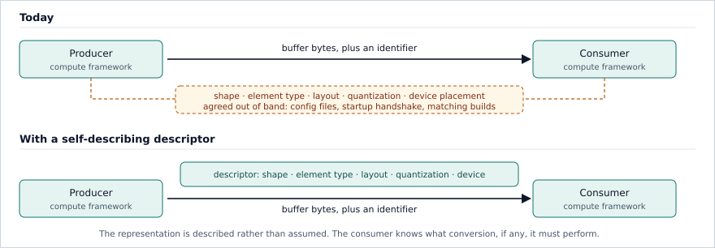
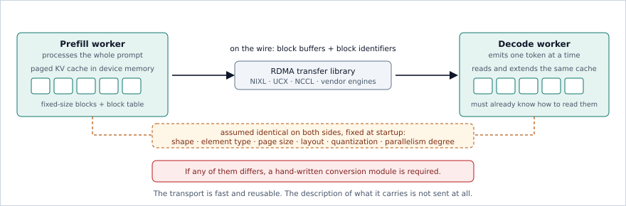

# Tensor Data Interchange: What Existing Solutions Cannot Express

*A review of the formats, protocols, and transports that move tensor data in AI/ML
inference, the gaps they leave, and a proposal for closing them.*

**Revision:** September 2026 · Also available as [PDF](prior-art.pdf)

---

## Abstract

AI/ML systems move large amounts of tensor data between processes, machines, and storage
tiers. This review examines the formats, protocols, and transports used for that purpose,
and shows that each one excels in a specific area but lacks support for the others. DLPack
shares memory inside one process but describes only strides. Apache Arrow provides a strong
buffer and IPC design built on a tabular data model. GGUF stores quantization parameters
well, but only for one runtime and only in files. NIXL, NCCL, and UCX move accelerator
memory across a network at full hardware speed, but they transfer byte ranges with no
description attached. The consequence is visible in disaggregated large-language-model
inference, where the key-value cache is transferred for every request: all production
systems examined here fix shape, element type, layout, and quantization outside the
transfer, send only opaque blocks and identifiers, and require hand-written conversion code
whenever the two endpoints differ. From this evidence the review identifies seven gaps and
states the capability each one requires: zero-copy sharing with a stated alignment,
self-delimiting streaming, self-description, layout negotiation, device and memory-placement
description, quantization metadata in the descriptor, and a language-agnostic ABI. The final
section introduces **Hurray**, a proposed specification for a tensor interchange format
designed to close all seven ([github.com/pgillet/hurray](https://github.com/pgillet/hurray),
[pgillet.github.io/hurray](https://pgillet.github.io/hurray)).

---

## 1. Introduction

Two kinds of software appear in this review, and the distinction matters only because one
depends on the other.

- **Data interchange solutions** move or store tensor data. DLPack, Apache Arrow, Arrow
  Flight, SafeTensors, GGUF, Zarr, NetCDF, OPeNDAP, NIXL, NCCL, and UCX are in this group.
- **Compute frameworks and libraries** perform computation on tensors. PyTorch, TensorFlow,
  JAX, NumPy, Eigen, xtensor, PLASMA, SLATE, TVM, MLC-LLM, MLX, vLLM, and NVIDIA Dynamo are
  in this group. They are the clients of the first group.

When an interchange solution cannot express something the client needs, the client pays for
it — with a copy, with private convention, or with adapter code written once per pair of
endpoints. Each of those workarounds is evidence of a missing capability, and this review
collects them.

Two terms are used throughout. A **tensor** is a multi-dimensional array of numbers of one
element type. A **descriptor** is the metadata that says how to interpret a tensor's bytes:
its shape, its element type, how it is arranged in memory, how it is quantized, and where it
resides. The central finding is that descriptors are rarely transmitted, and that
reconstructing them out of band costs time and bandwidth.

---

## 2. What a Descriptor Must Carry

**Layout.** A layout is how a tensor's elements are arranged in memory. The simplest
description is *strided*: one step size per dimension, which covers row-major order,
column-major order, transposes, and slices. Fast kernels do not use it. They use *tiled*
layouts, which store small rectangular blocks contiguously so that each block fits in cache,
and *packed* layouts, which rearrange operands into the exact order a vector or matrix unit
reads them. Sparse tensors use index structures such as compressed sparse rows. Attention
caches use *paged* layouts, described in § 4. No single layout is best: the right one depends
on the operation, the hardware, and which level of the memory hierarchy is saturated. A
format therefore cannot mandate a layout. It must describe the one the producer already has.

**Quantization.** Quantization stores a value as a low-precision integer together with a
scale and, optionally, a zero point, so that the value is approximated by
`scale × (quantized − zero_point)`. The parameters may apply to a whole tensor, to one
channel, or to a block of consecutive elements; the block size is part of the scheme. In
inference this is the normal case rather than an exception, so a tensor is not interpretable
without its quantization parameters.

**Device and memory placement.** A buffer may live in host memory, in discrete accelerator
memory, in memory addressed by both, or in a region registered with a network interface for
remote access. A consumer cannot use a buffer it cannot locate.

**Alignment and size.** Zero-copy means giving a consumer the producer's existing memory
instead of a duplicate. It requires agreement on alignment, ownership, and lifetime in
advance. Size determines how much this matters: a single weight matrix in a 70-billion-parameter model
is roughly 448 MB in 16-bit floating point, and a long-context attention cache is several
gigabytes per request. A copy imposed by an unstated alignment rule costs bandwidth that the
computation needs, and doubles peak memory use at the point where accelerator memory is
scarcest.

**Figure 1.** What crosses the boundary today, and what a self-describing descriptor changes.

---

## 3. The Landscape

### 3.1 Interchange solutions

**Table 1.** Data interchange solutions. *Self-describing* means the shape, element type,
layout, and quantization travel with the data.

| Solution | Kind | Layout model | Quantization | Streaming | Zero-copy | RDMA | Self-describing | Adoption |
|---|---|---|---|---|---|---|---|---|
| DLPack [1] | In-process ABI | Strided | ✗ | ✗ | ✓ | ✗ | Partial | Very high |
| Apache Arrow [2] | IPC, columnar | Row/column-major | ✗ | ✓ | ✓ | ✗ | Partial | Very high |
| Arrow Flight [3] | Streaming RPC | Row/column-major | ✗ | ✓ | ✗ | ✗ | Partial | Medium |
| SafeTensors [4] | File | Row-major | ✗ | ✗ | ✓ (mmap) | ✗ | Partial | High |
| GGUF [5] | File | Row-major + packed blocks | ✓ informal | ✗ | ✓ (mmap) | ✗ | ✓ | High |
| Zarr [6] | File, object store | Chunk grid | ✗ | ✗ | ✗ (compressed) | ✗ | ✓ | Medium |
| NetCDF [7] | File | Row-major | ✗ | ✗ | ✗ | ✗ | ✓ | High |
| OPeNDAP [8] | HTTP request | Row-major | ✗ | ✓ | ✗ | ✗ | ✓ | Medium |
| NIXL [9] | RDMA transport | None | ✗ | n/a | ✓ | ✓ | ✗ | Emerging |
| NCCL [10] | RDMA collectives | None | ✗ | n/a | ✓ | ✓ | ✗ | Very high |
| UCX [11] | RDMA abstraction | None | ✗ | n/a | ✓ | ✓ | ✗ | High |

Five facts from this table drive the rest of the review.

1. **No solution describes more than one layout family.** Every entry is limited to strides
   or to row-major order. None can state that a tensor is tiled, packed, sparse, or paged.
2. **Only GGUF puts quantization parameters in the descriptor**, and its schemes are defined
   by their reference implementation rather than by a portable specification, so
   interoperability requires reading that code.
3. **Arrow specifies buffer alignment (64 bytes minimum) and Arrow Flight loses it.** Flight
   carries data over gRPC, which requires at least one CPU copy per message and does not
   preserve alignment, so receivers copy again before handing memory to an accelerator or a
   linear-algebra kernel. Its message structure is nonetheless the right one: the descriptor
   precedes the data, messages are typed, and exchange is bidirectional.
4. **The RDMA transports describe nothing by design.** RDMA is remote direct memory access:
   one machine's network interface reads or writes another machine's registered memory
   without involving the remote processor. NIXL, NCCL, and UCX move registered byte ranges
   and require both endpoints to already agree on the format.
5. **File formats stop at the file.** SafeTensors, GGUF, Zarr, and NetCDF have no
   in-process ABI and no streaming protocol, so none of them can serve runtime interchange.

### 3.2 Compute frameworks and libraries

**Table 2.** What the clients use, and what they cannot state at the boundary.

| Framework | Interchange it uses | What it cannot express at the boundary |
|---|---|---|
| NumPy [12] | DLPack, buffer protocol, `.npy` | Nothing beyond strides; no path outside Python |
| PyTorch [13] | DLPack, SafeTensors, NCCL, RDMA libraries via serving stacks | Quantization parameters (kept in separate objects); packed and tiled layouts |
| TensorFlow [14] | DLPack, saved-model container, NCCL | Compiler-chosen physical layout; quantization is a property of the model artifact |
| JAX [15] | DLPack, checkpoint libraries, NCCL | Device sharding and compiler-chosen tiling; a handoff degrades to a dense single-device view |
| Eigen [16], xtensor [17] | None; both map caller-owned memory | Any layout not fixed at compile time; no descriptor of any kind |
| PLASMA [18], SLATE [19] | None | Tile parameters, which are private to the library although central to its performance |
| TVM [20], MLC-LLM [21] | DLPack; ad-hoc parameter bundles | The packed and tiled forms the compiler produces; grouped low-bit weight parameters |
| MLX [22] | DLPack, buffer protocol, existing file formats | Its packed quantized representation; unified memory has no single owning device |
| vLLM [23] | NIXL, external cache layers, NCCL | Paged cache geometry and quantization; fixed once at startup |
| NVIDIA Dynamo, TensorRT-LLM [24], [25] | NIXL, UCX, MPI | Cache layout across mismatched parallelism, handled by a hand-written module |

Three observations follow. First, nine of these systems support DLPack, so its descriptor
sets the effective limit on what can cross a boundary inside one process.
Second, the numerical libraries prove that adopting foreign memory is routine — Eigen and
xtensor both map caller-owned buffers — so the obstacle is the missing description, not the
sharing mechanism. Third, PLASMA and SLATE show that a serious library maintains several
layouts at once, which means a single mandated layout would force a conversion on someone in
every exchange.

---

## 4. Where the Gap Is Most Expensive

Large-language-model inference has two phases. **Prefill** processes the whole prompt at
once, is compute-bound, and fills the **key-value (KV) cache**: the stored attention keys and
values that let later steps avoid recomputing attention over the prompt. **Decode** emits one
token at a time, is memory-bandwidth-bound, and reads and extends that cache. The two phases
have different hardware profiles, so production systems run them on separate accelerators or
nodes [26], [27]. The cache, of logical shape `[layers, 2, heads, seq_len, head_dim]`, must
then be transferred for every request — several gigabytes at long context lengths. The cache
is stored in a **paged** layout [23]: a pool of fixed-size blocks plus a per-sequence block
table mapping logical positions to physical blocks, so a transfer moves a list of
non-contiguous blocks rather than one contiguous region.

**Figure 2.** KV cache transfer between a prefill worker and a decode worker.

**Table 3.** Six systems that transfer the KV cache.

| System | Transport used | Sent with the data | Assumed out of band |
|---|---|---|---|
| DistServe [26] | Intra-node interconnect | Layer and block references | Identical model build and cache layout |
| Mooncake [27] | Its own multi-NIC RDMA engine | Block keys and offsets | Shape, element type, paged layout |
| vLLM connectors [23], [28] | NIXL, Mooncake, LMCache | Raw blocks and block identifiers | Everything, fixed at cache-registration time |
| Dynamo, TensorRT-LLM [24], [25] | NIXL, UCX, MPI | Prompt tokens and connection parameters | Layout; parallelism mismatch resolved by a bespoke module |
| llm-d [29] | NIXL with a unified collective backend | Blocks and routing hints | Model identity and layout |
| LMCache [30], [31] | Engine connectors, multi-tier store | Compressed chunks and keys | Cache format and compression codec |

The pattern is identical in all six. The handshakes negotiate addresses and agent identity;
none of them negotiates a descriptor. Three costs follow.

1. **Endpoints are coupled in pairs.** Every connector assumes matching builds on both sides.
   Transfer between different engines, different versions, or different quantization settings
   requires a purpose-built adapter, because there is no neutral representation.
2. **Layout conversion is written by hand.** When prefill and decode run at different
   tensor-parallelism degrees, the block mapping differs; TensorRT-LLM converts the layout
   during transmission in a dedicated module, and vLLM's RDMA connector reshuffles the block
   mapping itself. A description of the source and destination layouts would let one routine
   handle every such case.
3. **Stored caches are unreadable elsewhere.** A cache written to a pool [27] or compressed
   to disk [31] carries no standard description, so only the software that wrote it can read
   it back. This removes most of the benefit of pooling it.

---

## 5. A Second Gap: Heterogeneous Composition

Every layout in § 3 describes one element type, one layout, and one quantization scheme
across the whole tensor. Several established techniques do not fit that model: one logical
tensor is assembled from regions that differ in precision, in layout, or in both, and each
region has its own buffers. Two composition rules appear in practice, and they answer
different questions about what a position in the tensor means.

**Partition: regions that do not overlap.** Each position belongs to exactly one region. A
residual-precision KV cache [34] is the clearest example. The most recent tokens are kept at
full precision, because they are still being written and are the most sensitive to
quantization error, while older tokens are stored 2-bit quantized. The split runs along the
sequence axis; the two regions have different element types, different quantization
parameters, and separate buffers; and no position is in both. A mixture-of-experts model that
assigns a different bit width per expert partitions the same way, along the expert axis.
Outside machine learning the pattern is long established and production-proven: adaptive-mesh
frameworks store one logical array as independently allocated boxes at different refinement
levels [35], volumetric formats mix constant tiles with dense leaves [36], and HDF5 virtual
datasets define one logical dataset as per-region mappings onto separate source files [37].

**Overlay: corrections on top of a base.** A base tensor spans the whole index space, and a
sparse second tensor supplies replacement values at scattered positions that the base also
covers. SpQR [32] uses this arrangement for sparse-quantized weights: it stores a weight
matrix at 3–4 bits per weight and keeps roughly one percent of the weights — the outliers
whose quantization error dominates the loss — at higher precision in a separate sparse
structure. KVQuant [33] applies the same arrangement to the KV cache. Reading position
`(i, j)` means consulting the sparse structure first and falling back to the dequantized base
only if no correction is stored there. Because base and corrections share positions, this
cannot be expressed as a partition.

**What this requires of a descriptor.** The same set of regions has two different meanings
under the two rules: under a partition the regions are the tensor, and under an overlay all
but one of them are exceptions to it. A descriptor must therefore carry three things — the
geometry of the regions, a complete description of each region (element type, layout,
quantization, buffers), and the composition rule that resolves a position. No mainstream
tensor interchange format carries any of the three, so both arrangements are today private to
the library that implements them.

---

## 6. The Gaps

**Table 4.** Seven gaps, what they cost today, and the capability each requires.

| # | Gap | What happens today | Required capability |
|---|---|---|---|
| 1 | Alignment is not stated | Receivers copy defensively before using a buffer; Arrow Flight loses alignment through gRPC | A normative minimum alignment, stricter where accelerator and IPC paths need page alignment, plus explicit lifetime transfer |
| 2 | No streaming form | File formats load whole artifacts; readers buffer input they cannot yet use | Descriptor before data, self-delimiting frames, no trailing index or back-reference in the stream |
| 3 | Descriptors are not transmitted | Format is fixed at startup and endpoints must match (§ 4) | A descriptor sent with every transfer: shape, element type, layout, quantization, device, and position within a larger tensor |
| 4 | Only one layout family per format | Producers repack, or endpoints agree privately; mismatches are resolved by hand-written modules | A layout vocabulary covering strided, tiled, sparse, paged, and composite forms, the composition rule for the last of these (§ 5), an extension path for hardware-specific packings, and negotiation so conversion happens once on the better-placed side |
| 5 | Device placement is not described | Placement lives in engine configuration; unified-memory systems have no single owning device | A placement model covering host, discrete, unified, and registered memory, in which device affinity can belong to an access rather than to the buffer |
| 6 | Quantization is not in the descriptor | Parameters travel in config files or framework-private objects; sub-byte packing order differs between implementations | Scheme identifier, scales, zero points and block size in the descriptor, with bit-exact packing order and a normative, versioned scheme set |
| 7 | No language-agnostic ABI | Formats stop at a file boundary or at one language's ecosystem | A stable C ABI carrying the descriptor and buffer handles, with no idioms of the implementation language |

No solution in Table 1 addresses more than three of the seven. DLPack addresses 1 and 7
inside one process. Arrow addresses 1, 2, and 7 for a tabular data model. GGUF addresses 3
and 6 for one runtime, in files. The RDMA transports address none of them, which is correct
for their role: they are a data plane, and what is missing is a description that travels
above them.

---

## 7. Hurray: A Proposal

**Hurray** is a proposed specification for a tensor interchange format and protocol, designed
against the seven gaps above. It defines a descriptor, a binary encoding for it, a streaming
protocol, a file container, and a C ABI. It defines no kernels, no scheduler, and no cache
policy: compute frameworks remain the clients, and existing transports remain the data plane.

**What would be new is the combination.** The individual capabilities all exist somewhere.
DLPack shares memory inside one process but describes only strides. Arrow supplies the buffer
and IPC discipline, for a tabular data model. GGUF puts quantization parameters in the
container, for one runtime and only in files. NIXL and UCX move accelerator memory across a
network without describing what they move. No solution in Table 1 provides more than three of
the seven capabilities, and none combines these four:

- one layout vocabulary spanning strided, tiled, sparse, paged, and composite tensors;
- quantization metadata inside the descriptor rather than beside it;
- a self-describing tensor carried over an RDMA data plane;
- a language-agnostic C ABI, so the format can be implemented in any language rather than
  bound from one.

The proposed capabilities map directly onto Table 4.

- **Zero-copy with a stated alignment.** A normative minimum buffer alignment, page alignment
  where accelerator and IPC paths require it, and explicit transfer of buffer ownership and
  lifetime.
- **Streaming and self-delimiting framing.** Each tensor's descriptor precedes its data, the
  stream is self-delimiting, and the streaming form contains no trailing index and no
  back-references, so a reader can start work before the input ends and a writer can emit
  tensors one at a time.
- **Self-description.** Shape, element type, layout, quantization, device placement, and
  position within a larger logical tensor travel with the buffer, on every path: in-process
  handoff, IPC, file, and RDMA.
- **Layout vocabulary and negotiation.** Named layouts for strided, tiled, sparse, paged, and
  composite tensors, an extension mechanism for hardware-specific packed forms, and a
  handshake in which each side declares what it can consume, so that a conversion is
  performed once by the side better placed to perform it.
- **Device and memory-placement description.** A placement model covering host memory,
  discrete accelerator memory, unified memory, and registered regions.
- **Quantization metadata.** Scheme identifier, scales, zero points, and block size in the
  descriptor, with bit-exact sub-byte packing and a normative, versioned scheme set.
- **Language-agnostic C ABI.** A stable boundary that any language can implement against,
  rather than one library with bindings.

Hurray is a specification effort, and the specification is public. The format is documented
at **[pgillet.github.io/hurray](https://pgillet.github.io/hurray)** and developed in the open
at **[github.com/pgillet/hurray](https://github.com/pgillet/hurray)**. Review of the
specification, and of the gap analysis in § 6 that motivates it, is welcome.

Several questions remain open and are stated as such. How large should the layout vocabulary
be, given that every named layout is a burden on every implementation and every omission
forces a copy? What should negotiation exchange beyond a list of supported layouts, given
that the better-placed side depends on conversion cost that neither side currently
expresses? Should device affinity belong to a buffer or to an access? How should quantization
schemes be parameterized so that new ones do not require a new scheme identifier each time?

---

## 8. Conclusion

The transports used for tensor data are fast, general, and widely deployed. The descriptions
of what they carry are not transmitted at all. Compute frameworks compensate individually:
PyTorch keeps quantization parameters outside the tensor, JAX cannot express sharding across
a handoff, vLLM fixes its cache format at startup and sends opaque blocks, and TensorRT-LLM
contains a hand-written layout converter. These are not defects in those systems; they are
what an interchange layer with an insufficient descriptor forces on their authors.

What is missing is a portable description that travels with the bytes, expressive enough to
state that a tensor is tiled, paged, sparse, block-quantized, or composed of heterogeneous
regions, and carried identically across in-process, IPC, file, and RDMA paths. Table 4 states
the seven capabilities such a description requires. Hurray is a proposal to specify them.

---

## References

[1] DLPack: Open In-Memory Tensor Structure. <https://github.com/dmlc/dlpack>

[2] Apache Arrow. <https://arrow.apache.org>

[3] Apache Arrow Flight. <https://arrow.apache.org/docs/format/Flight.html>

[4] SafeTensors. Hugging Face. <https://github.com/huggingface/safetensors>

[5] GGUF: GPT-Generated Unified Format. <https://github.com/ggerganov/ggml/blob/master/docs/gguf.md>

[6] Zarr: chunked, compressed, N-dimensional arrays. <https://zarr.dev>

[7] NetCDF. Unidata / UCAR. <https://www.unidata.ucar.edu/software/netcdf/>

[8] OPeNDAP (DAP2 / DAP4). <https://www.opendap.org>

[9] NIXL: NVIDIA Inference Xfer Library. <https://github.com/ai-dynamo/nixl>

[10] NCCL: NVIDIA Collective Communications Library. <https://developer.nvidia.com/nccl>

[11] P. Shamis et al., "UCX: An Open Source Framework for HPC Network APIs and Beyond," *HOTI*,
2015. <https://openucx.org>

[12] C. R. Harris et al., "Array programming with NumPy," *Nature* 585, 357–362, 2020.

[13] A. Paszke et al., "PyTorch: An Imperative Style, High-Performance Deep Learning Library,"
*NeurIPS*, 2019. <https://arxiv.org/abs/1912.01703>

[14] M. Abadi et al., "TensorFlow: A System for Large-Scale Machine Learning," *OSDI*, 2016.
<https://arxiv.org/abs/1605.08695>

[15] JAX. <https://docs.jax.dev>

[16] Eigen. <https://eigen.tuxfamily.org>

[17] xtensor. <https://xtensor.readthedocs.io>

[18] PLASMA: Parallel Linear Algebra Software for Multicore Architectures.
<https://icl.utk.edu/plasma/>

[19] M. Gates et al., "SLATE: Software for Linear Algebra Targeting Exascale," SLATE Working
Notes. <https://icl.utk.edu/slate/>

[20] T. Chen et al., "TVM: An Automated End-to-End Optimizing Compiler for Deep Learning,"
*OSDI*, 2018. <https://arxiv.org/abs/1802.04799>

[21] MLC-LLM. <https://llm.mlc.ai>

[22] MLX: an array framework for Apple silicon. <https://ml-explore.github.io/mlx/>

[23] W. Kwon et al., "Efficient Memory Management for Large Language Model Serving with
PagedAttention," *SOSP*, 2023. <https://arxiv.org/abs/2309.06180>

[24] NVIDIA Dynamo.
<https://developer.nvidia.com/blog/introducing-nvidia-dynamo-a-low-latency-distributed-inference-framework-for-scaling-reasoning-ai-models/>

[25] Disaggregated Serving in TensorRT-LLM. NVIDIA.
<https://nvidia.github.io/TensorRT-LLM/blogs/tech_blog/blog5_Disaggregated_Serving_in_TensorRT-LLM.html>

[26] Y. Zhong et al., "DistServe: Disaggregating Prefill and Decoding for Goodput-optimized
Large Language Model Serving," *OSDI*, 2024. <https://arxiv.org/abs/2401.09670>

[27] R. Qin et al., "Mooncake: A KVCache-centric Architecture for Serving LLM Chatbot,"
*USENIX FAST*, 2025. <https://arxiv.org/abs/2407.00079>

[28] vLLM: disaggregated prefilling and KV cache connectors.
<https://docs.vllm.ai/en/stable/features/disagg_prefill/>

[29] llm-d: Kubernetes-native distributed inference.
<https://llm-d.ai/docs/guide/Installation/pd-disaggregation>

[30] LMCache: a KV cache layer for LLM serving. <https://arxiv.org/html/2510.09665v2>

[31] Y. Liu et al., "CacheGen: KV Cache Compression and Streaming for Fast Large Language
Model Serving," *ACM SIGCOMM*, 2024. <https://arxiv.org/abs/2310.07240>

[32] T. Dettmers et al., "SpQR: A Sparse-Quantized Representation for Near-Lossless LLM Weight
Compression," 2023. <https://arxiv.org/abs/2306.03078>

[33] C. Hooper et al., "KVQuant: Towards 10 Million Context Length LLM Inference with KV Cache
Quantization," 2024. <https://arxiv.org/abs/2401.18079>

[34] Z. Liu et al., "KIVI: A Tuning-Free Asymmetric 2bit Quantization for KV Cache," 2024.
<https://arxiv.org/abs/2402.02750>

[35] W. Zhang et al., "AMReX: A Framework for Block-Structured Adaptive Mesh Refinement,"
*JOSS*, 2019. <https://amrex-codes.github.io>

[36] K. Museth, "VDB: High-Resolution Sparse Volumes with Dynamic Topology," *ACM TOG*, 2013.
<https://www.openvdb.org>

[37] HDF5 Virtual Datasets. The HDF Group.
<https://docs.hdfgroup.org/hdf5/develop/_v_d_s.html>
